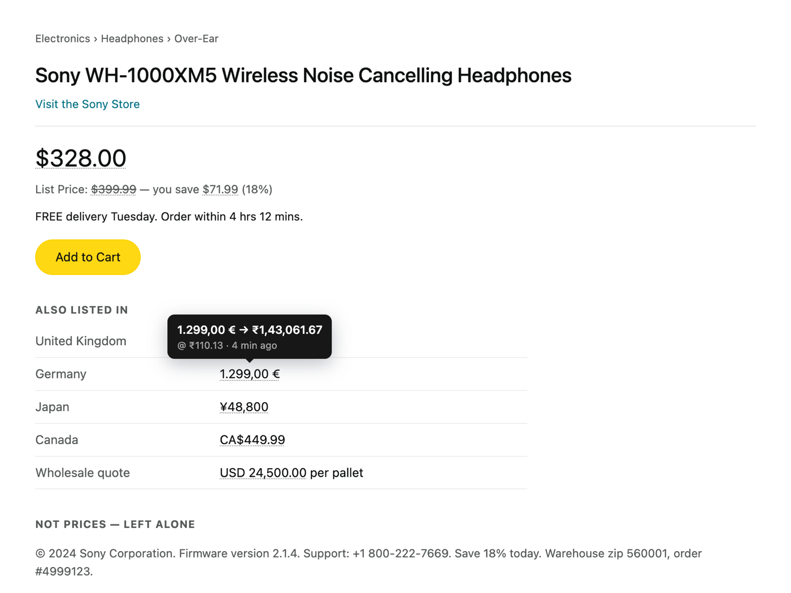
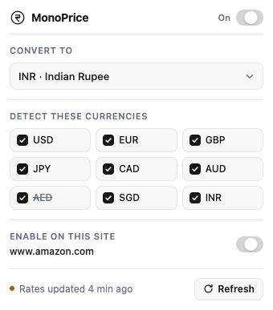
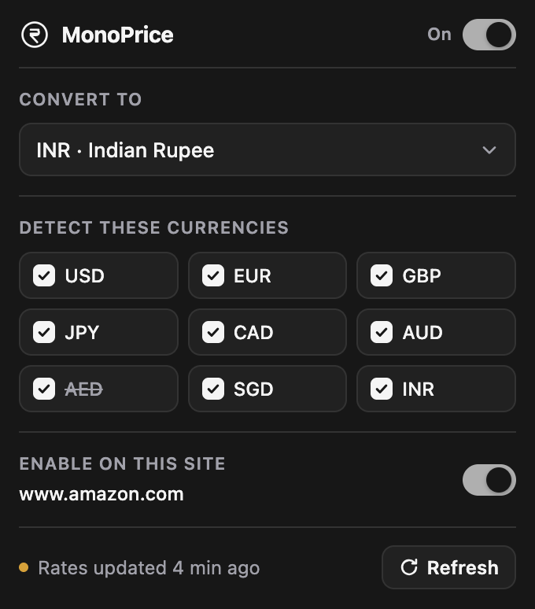

# MonoPrice

Hover any price on any page to see it in your currency, with the rate and how old it is. Detects `$49.99`, `€1.299,00`, `49,99 €`, `USD 49.99` and `₹1,08,750` forms while ignoring years, versions, phone numbers and percentages. Right-click a selection and choose **Convert with MonoPrice** for anything the detector misses. Rates come from frankfurter.dev, refreshed every 15 minutes.

The popup follows your system theme. Currencies with no published rate are struck through.

 

**Load unpacked:** open `chrome://extensions`, turn on **Developer mode**, click **Load unpacked**, and select this folder.

**Add a currency:** add one entry to `CURRENCIES` in `detect.js` — its symbols, `locale`, and its own `group`/`decimal` convention. The popup's dropdown and checkbox list are built from that object, so nothing else needs editing. The code must exist in the frankfurter dataset; `AED` does not, so AED amounts show `Rate unavailable`.
